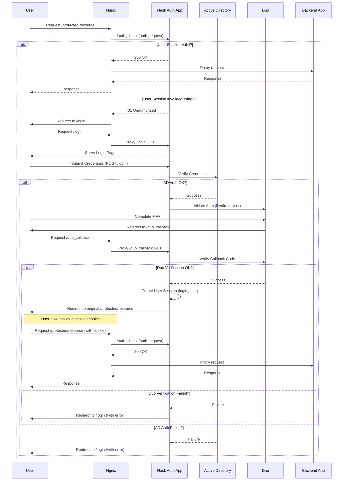

# Reverse Proxy Auth Gateway

[](https://github.com/Ozy311/backend-duo)
[](https://www.python.org/)
[](https://flask.palletsprojects.com/)

## Overview

This project provides a robust authentication layer designed to sit in front of backend applications, particularly legacy systems like Apache Tomcat-hosted Java apps. It acts as a gatekeeper, ensuring users are properly authenticated via Active Directory (AD) and Duo Multi-Factor Authentication (MFA) before granting access.

Leveraging Nginx as a high-performance reverse proxy and a Flask-based web application for the authentication logic, this gateway enhances security without requiring modifications to the downstream application.

## Key Features

*   **🛡️ Secure Authentication Flow:**
    *   Primary authentication against **Active Directory** using LDAPS.
    *   Secondary **Duo Security MFA** step using the modern Universal Prompt (Web SDK v4).
*   **🔒 Reverse Proxy Integration:** Designed to work seamlessly with Nginx's `auth_request` module to protect backend resources.
*   **🌐 Flexible Configuration:** Uses environment variables (`.env` file) for sensitive configuration (AD/Duo credentials, server details, Flask secrets).
*   **👤 Session Management:** Utilizes `Flask-Login` for secure, server-signed session cookies.
*   **🎨 Customizable UI:** Simple, themeable login interface built with Flask templates (Jinja2) and basic CSS.
*   **<0xF0><0x9F><0xA7><0x8A> Proxy Aware:** Supports routing Duo API communication through an HTTP/HTTPS proxy if required by the network environment.

## Technology Stack

*   **Reverse Proxy:** Nginx
*   **Auth Application:** Python 3.9+ / Flask
*   **Authentication:** `ldap3` (for AD), `duo_universal_python` (for Duo)
*   **Session Handling:** `Flask-Login`
*   **Forms:** `Flask-WTF`
*   **Environment:** `python-dotenv`, Virtual Environments (`venv`)

## Workflow Diagram (Conceptual)



## Project Structure

```
. (backend-duo/)
├── flask_auth/
│   ├── __init__.py
│   ├── app.py             # Main Flask application logic, routes
│   ├── auth.py            # AD authentication logic
│   ├── models.py          # User model for Flask-Login
│   ├── requirements.txt   # Python dependencies
│   ├── static/            # Static files (CSS, JS, images)
│   │   ├── css/style.css
│   │   └── logo.png
│   └── templates/         # HTML templates (Jinja2)
│       ├── base.html
│       └── login.html
├── nginx/
│   └── nginx.conf         # Example Nginx configuration
├── documentation/
│   ├── *.md               # Project documentation files
├── venv/                  # Python virtual environment (ignored by git)
├── .env                   # Environment variables (local, sensitive - DO NOT COMMIT)
├── .env.example           # Example environment file structure
├── .gitignore
├── README.md              # This file
└── ... (other config files)
```

## Setup & Local Development

### Prerequisites

*   Python 3.9+ and `python3-venv`
*   Git
*   Access to an Active Directory domain controller (LDAPS recommended)
*   A Duo Security account with a configured **Web SDK v4** application.
*   (Optional) An HTTP/HTTPS proxy if needed for the Flask app to reach Duo's API.

### Steps

1.  **Clone the Repository** (if you haven't already):
    ```bash
    # git clone <your-repo-url>
    cd backend-duo
    ```

2.  **Create and Activate Virtual Environment:**
    ```bash
    python3 -m venv venv
    source venv/bin/activate
    ```

3.  **Configure Environment Variables:**
    *   Copy the example file:
        ```bash
        cp .env.example .env
        ```
    *   Edit `.env` with your specific details:
        *   `FLASK_SECRET_KEY`: **Required.** Generate a strong, random key (e.g., using `openssl rand -hex 32`).
        *   `AD_SERVER_URIS`: List of your AD server URIs (e.g., `ldaps://dc1.example.com ldaps://dc2.example.com`).
        *   `AD_BIND_DN`: Service account DN for initial bind (e.g., `CN=ServiceAccount,OU=Services,DC=example,DC=com`).
        *   `AD_BIND_PASSWORD`: Password for the service account.
        *   `AD_SEARCH_BASE`: Base DN to search for users (e.g., `OU=Users,DC=example,DC=com`).
        *   `AD_SEARCH_FILTER_TEMPLATE`: LDAP filter template (default `(sAMAccountName={username})` is usually fine).
        *   `AD_USE_TLS`: Set to `true` for LDAPS (recommended).
        *   `AD_TLS_REQ_CERT`: Set to `require` or `allow` depending on your CA setup (`require` needs `AD_TLS_CACERT_PATH`).
        *   `AD_TLS_CACERT_PATH`: Path to your CA certificate file if using `require`.
        *   `DUO_CLIENT_ID`: Your Duo application's Client ID.
        *   `DUO_CLIENT_SECRET`: Your Duo application's Client Secret.
        *   `DUO_API_HOST`: Your Duo application's API Hostname.
        *   `DUO_REDIRECT_URI`: **Crucial.** The full URI Nginx will expose for the callback (e.g., `https://auth.example.com/duo_callback`). This *must* match the Redirect URI configured in the Duo Admin Panel exactly.
        *   `HTTPS_PROXY` / `HTTP_PROXY`: (Optional) Set if the Flask app needs a proxy to reach the Duo API host (e.g., `http://proxy.example.com:3128`).

4.  **Install Dependencies:**
    *   Make sure your virtual environment is active.
    *   (If using a proxy for `pip` itself): `pip install --proxy <your-pip-proxy> -r flask_auth/requirements.txt`
    *   (Standard install): `pip install -r flask_auth/requirements.txt`

5.  **Add Company Logo:**
    *   Place your company logo file named `logo.png` inside the `flask_auth/static/` directory. This file is not tracked by Git and must be added manually.

### Running the Flask App Locally

**Important:** This runs the Flask development server, suitable only for testing. For production, use a proper WSGI server (Gunicorn/uWSGI) behind Nginx.

1.  Ensure your `.env` file is correctly configured in the project root (`backend-duo/`).
2.  Activate the virtual environment: `source venv/bin/activate`
3.  Run the app module:
    ```bash
    python -m flask_auth.app
    ```
4.  The server will start, typically on `http://0.0.0.0:5000`. Access it via `http://localhost:5000` in your browser. You will likely be redirected to `/login`. Note that the full flow requires Nginx integration.

## Nginx Configuration

Refer to the `nginx/nginx.conf` file for a sample Nginx configuration.

Key aspects:

*   **Upstreams:** Defines `flask_app` (pointing to Gunicorn socket) and `tomcat_app` (pointing to your backend application).
*   **`/auth_check` Location:** An internal location used by `auth_request` to verify the user's session with the Flask app.
*   **Public Locations (`/login`, `/logout`, `/duo_callback`, `/static`):** Proxied directly to the Flask/Gunicorn application.
*   **Protected Location (`/`):**
    *   Uses `auth_request /auth_check` to gate access.
    *   Proxies requests to `tomcat_app` if authentication succeeds.
    *   Uses `error_page 401 = @error401` to redirect unauthenticated users.
*   **`@error401` Location:** Handles the 401 response from `auth_request` and redirects the user to `/login`, preserving the original requested URI via `?redirect_uri=$request_uri`.

Ensure Nginx is configured to listen on the desired public ports (e.g., 80, 443) and that the necessary modules (`ngx_http_proxy_module`, `ngx_http_upstream_module`) are available.

## Deployment (Production/Staging - Wheel Based)

This setup uses **Python Wheels** for offline package installation, **Gunicorn** as the WSGI server, and **Systemd** to manage the Gunicorn process. This avoids needing internet access or proxy configuration on the deployment server itself during package installation.

### Part A: Preparation (On a machine with internet/proxy access)

1.  **Get Project Code:** Ensure you have the latest project code.
2.  **Create/Clean Wheels Directory:** In the project root, ensure you have a clean `wheels` directory:
    ```bash
    rm -rf wheels
    mkdir wheels
    ```
3.  **Build Wheels:** Use `pip wheel` with your proxy (if needed) to build/download all necessary `.whl` files into the `wheels` directory based on `flask_auth/requirements.txt`:
    ```bash
    # Example using http://proxy.example.com:3128
    pip wheel --proxy http://proxy.example.com:3128 --wheel-dir=wheels -r flask_auth/requirements.txt
    # Or without a proxy:
    # pip wheel --wheel-dir=wheels -r flask_auth/requirements.txt
    ```
4.  **Package for Deployment:**
    *   Bundle the entire project code.
    *   Ensure `flask_auth/requirements.txt` is up-to-date (e.g., includes `ldap3`, `Flask-WTF`).
    *   Include the fully populated `wheels/` directory.
    *   Include a `.env` file configured with **production values**. **Crucially, ensure this production `.env` file does NOT have inline comments (`#`) on the same line as variable assignments**, as systemd's `EnvironmentFile` directive may parse them incorrectly. Also, if a proxy is needed for the *Flask app* to reach Duo, ensure the standard `HTTPS_PROXY` and `HTTP_PROXY` variables are set correctly in this file.

### Part B: Deployment (On the server, as root)

1.  **Reset Server Directory (Recommended for clean install):**
    ```bash
    systemctl stop backend-duo.service # Ignore errors if not running
    rm -rf /opt/backend-duo
    mkdir -p /opt/backend-duo
    chown www-data:www-data /opt/backend-duo # Adjust user/group if needed
    ```
2.  **Copy Files:** Transfer and extract your bundled project code, `wheels` directory, and production `.env` file to `/opt/backend-duo`.
3.  **Set Ownership:** Ensure the correct user/group owns all deployed files:
    ```bash
    chown -R www-data:www-data /opt/backend-duo
    ```
4.  **Create Virtual Environment:**
    ```bash
    python3 -m venv /opt/backend-duo/venv
    chown -R www-data:www-data /opt/backend-duo/venv
    ```
5.  **Install from Local Wheels:** Install packages using only the files in the `wheels` directory:
    ```bash
    /opt/backend-duo/venv/bin/pip install --no-index --find-links=/opt/backend-duo/wheels -r /opt/backend-duo/flask_auth/requirements.txt
    ```
6.  **Verify Gunicorn:**
    ```bash
    ls -l /opt/backend-duo/venv/bin/gunicorn
    ```
7.  **Configure Systemd Service:** Create/edit `/etc/systemd/system/backend-duo.service` (ensure `EnvironmentFile` points to your `.env`):
    ```ini
    [Unit]
    Description=Gunicorn instance to serve backend-duo Flask app
    After=network.target

    [Service]
    User=www-data
    Group=www-data
    WorkingDirectory=/opt/backend-duo
    EnvironmentFile=/opt/backend-duo/.env
    RuntimeDirectory=backend-duo
    ExecStart=/opt/backend-duo/venv/bin/gunicorn --workers 3 --bind unix:/run/backend-duo/gunicorn.sock -m 007 flask_auth.app:app
    Restart=always

    [Install]
    WantedBy=multi-user.target
    ```
8.  **Configure Nginx:** Ensure your Nginx configuration points the `flask_app` upstream to `unix:/run/backend-duo/gunicorn.sock`. Test the configuration:
    ```bash
    nginx -t
    ```
9.  **Reload, Enable and Start Services:**
    ```bash
    systemctl daemon-reload # IMPORTANT: Reload systemd to pick up service file changes AND EnvironmentFile contents
    systemctl enable --now backend-duo.service
    systemctl reload nginx # Or restart if needed
    ```
10. **Verification:** Check service status, socket file, logs, and test access via browser.
    ```bash
    systemctl status backend-duo.service
    ls -l /run/backend-duo/gunicorn.sock
    # Check logs carefully for correct startup and any errors, especially related to environment variables
    journalctl -u backend-duo.service --no-pager | cat
    # Follow logs during testing:
    # journalctl -u backend-duo.service -f
    # tail -f /var/log/nginx/access.log /var/log/nginx/error.log
    ```

---